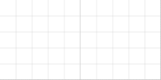

Custom tiles layout library with built-in drag'n'drop support and CSS3 animations.

See the [example](example/index.html).


## Concepts

We have a grid with tile elements of various sizes.  
Those tiles are "sortable" by the user.  
The grid has the following custom layout algorithm:

1. Split the container element into cells.
2. Split the layout into rows.
3. Layout the given tiles inside the row in top-right direction.
4. If tile cannot be placed in a row - go to the next row (presume the initial tiles order)

### Tile types and grid size

We have 3 predefined (hardcoded) tile sizes:

* `pin` - 1x1 tile
* `app` - 2x2 tile
* `feed` - 3x2 tile

### Grid size

Currently the library determines the width of the grid **automatically** based on the container DOM element width.  
The height of each *layout row* equals **2 grid cells** by default.  
The number of rows is **unlimited** (rows added on demand during the layout phase).

### Algorithm visualization




## Install it

1. Install [Bower](http://bower.io)  
  Run `npm install -g bower` in terminal
2. Install the component using:  
  Run `bower install yetu/pocketry` in terminal

and then add the script to your page:

`<script src="bower_components/pocketry/dist/pocketry.min.js"></script>`

## Use it

The current implementation assumes that you have tile elements **rendered in DOM before** you init the library.

```javascript
var grid = new Pocketry('.tiles', 2);

```

### Pocketry(container, rowSpan, options)
Creates the whole grid with layout rules and drag'n'drop feature in the specified *container* element.

### container
The selector of the element which will be turned into the grid.

### rowSpan
The height of each layout row.

### options.slotSize (default= 100)
The size of the grid cell in pixels.

### options.filterClass (default= 'is-hidden')
All DOM elements within the container, which have the specified class, **will not be turned into tiles**.


## Specifying tiles parameters

Each tile is represented by a single DOM element.  
This element can have these attributes:

* `data-type` - the type of the tile (`pin`, `feed` or `app`)
* `data-freezed` - the element cannot be moved by user interaction


## Events API

The grid instance will fire some events during its lifetime.  
You can add listeners using the code:

`grid.subscribe(eventName, fn);`

### relayout
This event is triggered when the grid relayout has happened.

## Grid API

### grid.TILES
The list of all available tile types, which can be used as `data-type` attributes.

### grid.layout
The model of the current layout.


# Getting started with writing code

* install [Bower](http://bower.io)
* install [Gulp](http://gulpjs.com/)  
  `npm install -g gulp`
* `bower install` downloads third-party components
* Run `gulp tdd` to start watching files and executing tests
* open `example/index.html` in a reasonably modern browser


# Building the component

* `gulp dist` creates release files in `./dist`

**Note:** in this case the package will not be checked in.

# Publishing the component

* `gulp patch` makes v0.1.0 → v0.1.1
* `gulp minor` makes v0.1.1 → v0.2.0
* `gulp major` makes v0.2.0 → v1.0.0

**Note:** All this commands will **commit & push** the changes to `master`!

# Contributors
* [mr-mig](http://github.com/mr-mig)
* [eliyetu](http://github.com/eliyetu)
* [FND](http://github.com/FND)
